<h1>Web App using Spring MVC Spring Data JPA Thymeleaf Spring Security</h1>

<h3>Partie 1 :</h3>

Créer une application Web JEE basée sur Spring MVC, Thylemeaf et Spring Data JPA qui permet de gérer les patients. 
L'application doit permettre les fonctionnalités suivantes :  
Afficher les patients  
Faire la pagination   

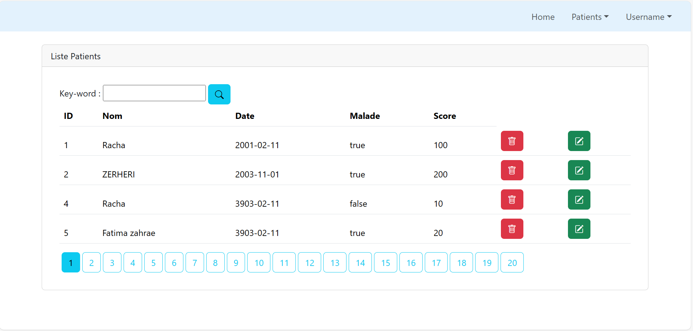

Chercher les patients :

Supprimer un patient :

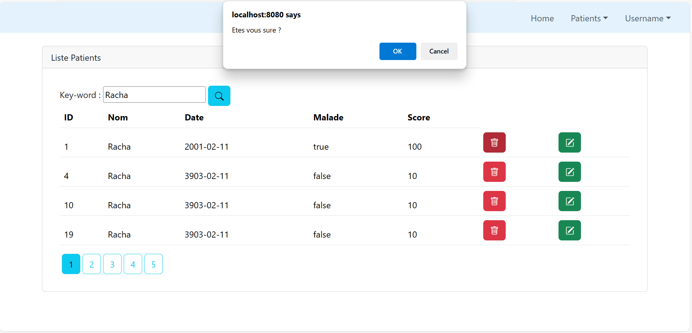

Ajouter un patient :

Modifier  un patient :

Partie 3 : Sécurité avec Spring security  :  
InMemomy Authentication: 

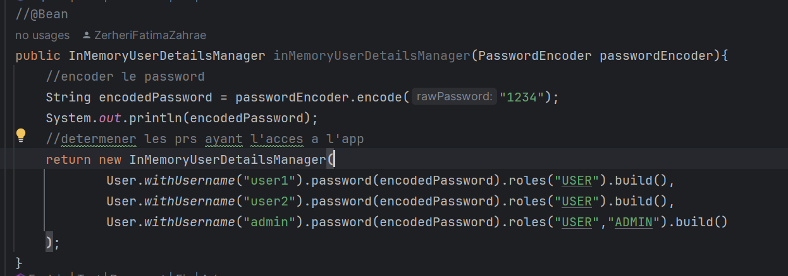

JDBC Authentication :

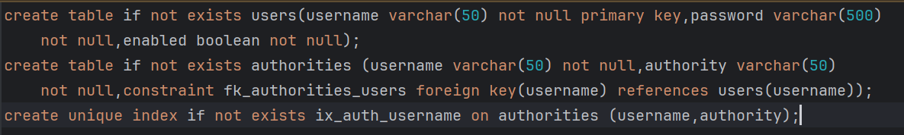
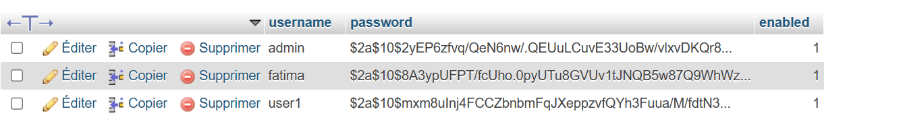
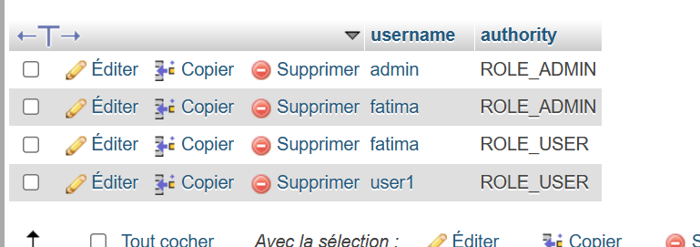

UserDetails Service :

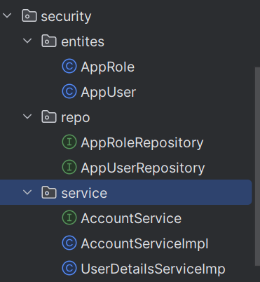

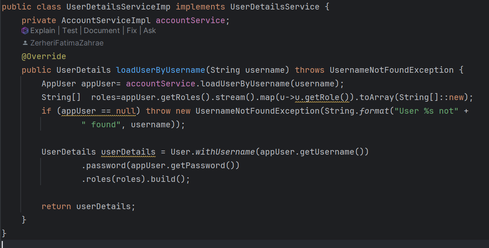
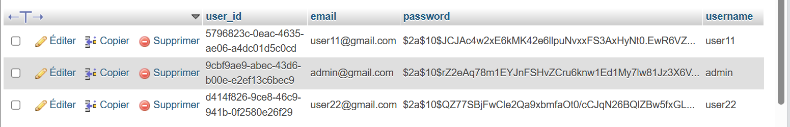
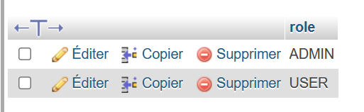
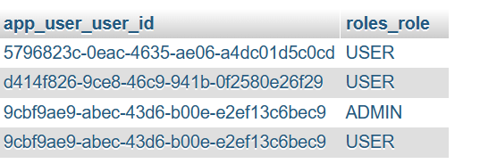

